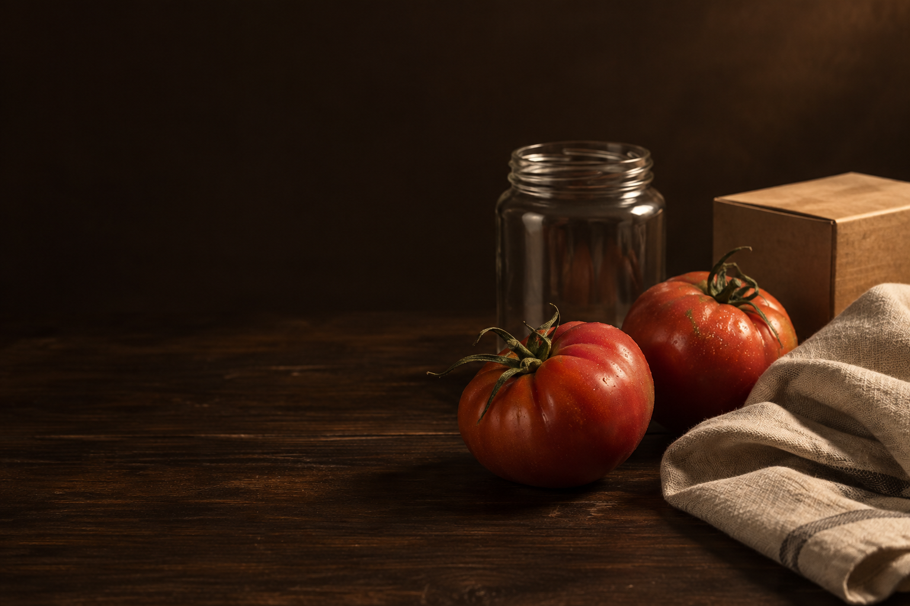
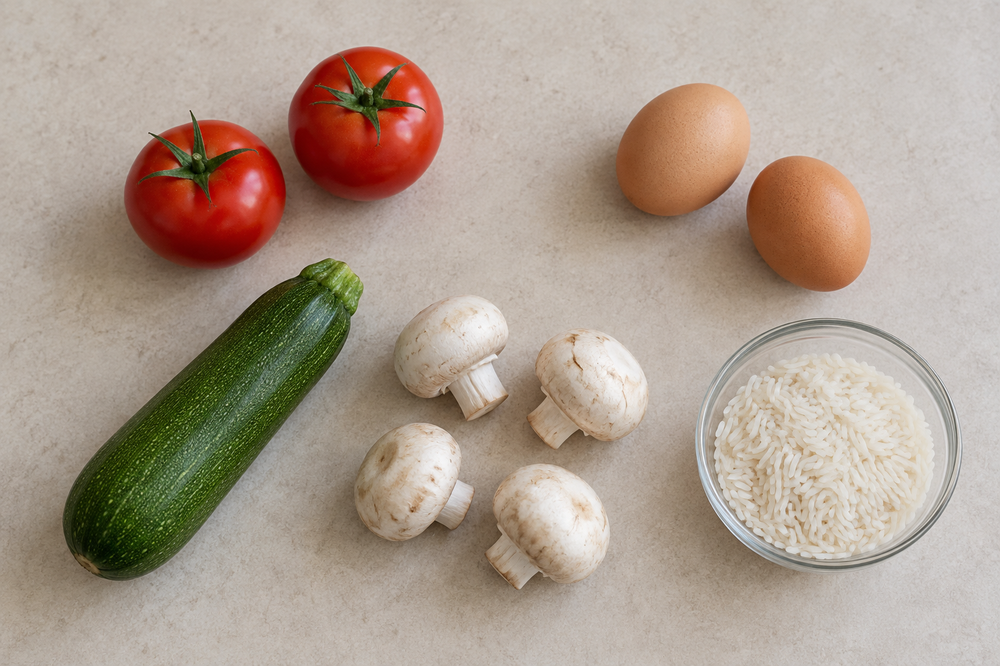
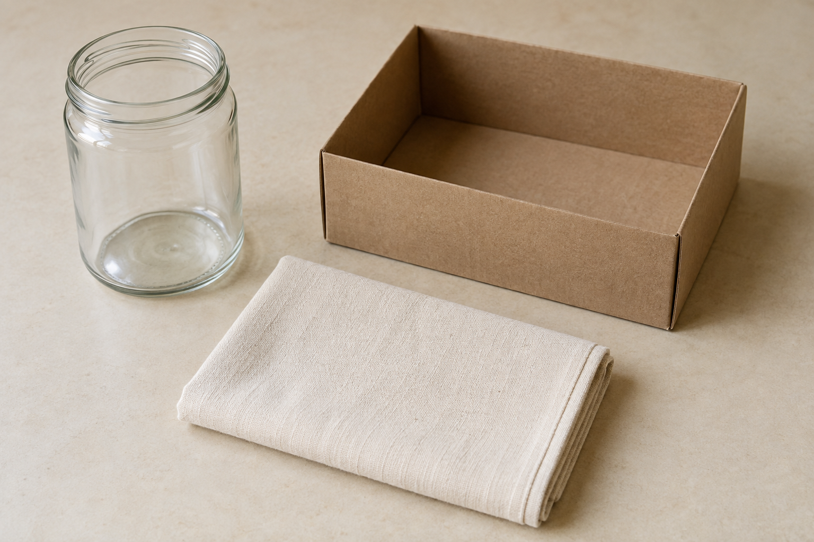

# 就地取材 · 项目说明

## 一、小组 / 个人信息

本项目按单机开发流程推进。参赛者真实姓名与职业尚未提供，提交前填写下表；如个人参赛，无需补充小组成员。

| 身份 | 姓名 | 职业 / 身份 | 分工简介 |
| --- | --- | --- | --- |
| 负责人 / 个人参赛者 | 待填写 | 待填写 | 产品决策与演示；使用 TRAE 完成应用开发，并结合 Codex 准备需求、资产、修复和交付资料。 |

## 二、作品信息

| 项目 | 内容 |
| --- | --- |
| 作品名称 | 就地取材 |
| 作品简介 | 「就地取材」把家里已有的食材和闲置物品转成可执行的晚餐菜单与旧物改造方案。用户拍照或录入清单，确认大致用量和限制，就能获得材料分配、步骤与缺料替代；常备食材仓库让油盐等用品不用每次重复添加。 |
| 目标人群 | 独居、合租的年轻人，以及希望减少食材浪费、重复采购和闲置物品堆积的家庭用户。 |
| 解决什么问题 | 面对现有食材不知道怎么组合成一餐；菜谱需要的材料与实际库存不匹配；油盐等常备品重复录入；闲置物品缺少简单可做的再利用方法。 |
| 核心主张 | 把家里已有的，变成今天用得上的。 |
| 参赛方向 | 生活创意：日常资源再利用。 |

## 三、核心功能与亮点

### 从「有什么」到「怎么做」

上传图片或手动录入后，用户可以编辑名称、数量和单位，并设置人数、目标时间、忌口等限制。「今晚吃什么」给出一餐菜单、各道菜的用量和步骤，以及整餐制作顺序。「物品第二人生」提供可选择的旧物改造用途、所需工具与成品检查，一次采用一种方案。

### 自动估量，降低输入负担

食材图片识别后自动填入大致克重、体积或个数。模型没有给出估量时，应用补入常见参考份量，并区分「图片估算」与「参考估算」。用户可以直接一次确认，也能自行修改，无需逐项称重；估量和计算出的余量均不代表精确测量。

### 常备食材仓库

用户可自行增删油、盐、酱油等常备品，调整数量、单位与是否使用。设置保存到当前浏览器，选中的用品在后续生成时自动带入；仓库和本次识别清单会合并，减少重复填写。

### 方案必须用得上

生成结果不仅是一段建议文字，还包含资源引用、具体用量、步骤和限制条件。服务端验证结构与资源分配，避免多道菜重复占用同一批食材。缺少材料时可尝试「这项没有，换个办法」，重新规划并说明差异；用户也能开启「只用已有资源」。

### 来源清楚，失败可恢复

页面区分「固定演示样例」和「Gemini 实时生成」。真实请求失败时保留输入、显示错误并允许重试，固定样例由用户主动加载。样例图片为 AI 生成的展示素材，不代表真实拍摄或实际改造后的成品。

## 四、技术实现

| 层次 | 实现 |
| --- | --- |
| 界面 | Next.js 16、React 19、TypeScript、Tailwind CSS 4、lucide-react；单页切换两种生活场景。 |
| 图片与生成 | Google Gemini，通过官方 `@google/genai` SDK 在服务端调用。 |
| API | `/api/recognize` 识别资源；`/api/plan` 生成、替代与校验方案。 |
| 约束校验 | Zod 结构校验与资源校验；应用汇总用量并计算余量。 |
| 本地保存 | `localStorage` 保存常备仓库；不保存图片或密钥，不提供跨设备同步。 |
| 部署 | GitHub 保存源码并提供 Pages 静态演示；完整 AI 功能在本地或支持 Next.js 服务端的平台运行。 |

密钥仅使用服务端环境变量 `GEMINI_API_KEY`，模型通过 `GEMINI_MODEL` 配置。图片识别不会确认食品安全；对名称或用量不确定的内容，用户可在生成前调整。

## 五、作品展示

- 源码：[GitHub · yqia03/trae_gp](https://github.com/yqia03/trae_gp)
- 静态演示：[GitHub Pages 入口](https://yqia03.github.io/trae_gp/)（发布状态以仓库 Actions 和实际访问为准）
- 完整 AI 版：[本地运行说明](../README.md#立即运行完整-ai-版本)

GitHub Pages 不能运行 Next.js 服务端 API。静态演示用于展示固定案例、界面交互和常备仓库；真实图片识别及实时方案生成应在配置密钥的完整版本中演示。

### 推荐演示顺序（约两分钟）

1. **说明场景**：家里有食材和闲置物品，希望直接知道今天能怎么用。
2. **晚餐闭环**：加载「晚餐」演示样例，展示食材清单、菜单、具体用量、制作顺序和资源余量，展开并勾选做菜步骤。
3. **减少重复输入**：展开常备仓库，添加一种调味品，修改用量或勾选状态，刷新说明保存效果。
4. **资源再利用**：加载「旧物」演示样例，切换方案，展示材料占用与改造步骤。
5. **真实 AI（本地完整版本）**：上传食材图片，展示自动估量，确认后生成菜单，并指出「Gemini 实时生成」来源标记。

### 展示素材

下图是项目原创 AI 视觉素材与演示输入图，可用于说明主题；它们不是运行截图或实际制作结果。

| 食材识别样例图 | 旧物再利用样例图 |
| --- | --- |
|  |  |

如需提交实际界面截图或录屏，请截取正在运行的页面；尚未提供的截图、视频与参赛者身份信息不在本文中虚构。

## 六、完成情况与边界

本地已通过 23 项回归测试和 Webpack 生产构建；已验证自动估量后真实菜单生成，以及常备食材仓库的增删、修改与刷新保存。静态发布状态以 GitHub Actions 和实际页面访问为准；云端实时 Gemini 服务未部署。

本次 Demo 不包含账号、云端库存、购物、营养评分或碳排计算。它重点展示从已有资源到可执行方案的完整流程；不宣称未经测量的节约金额、减排比例或烹饪效果。

开发与验收依据保留在 [产品规格](competition/BRIEF.md)、[接口契约](competition/MODEL_CONTRACT.md)、[演示与验收](competition/DEMO.md) 和 [资料来源](competition/REFERENCES.md) 中；现场用户修订优先于赛前规划默认值。
